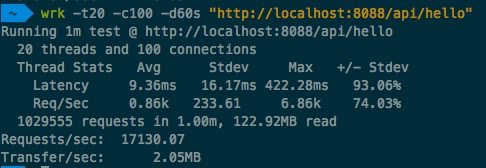

## Quest-1

串行GC和并行GC比较：  
相同点：串行GC和并行GC新生代都使用标记-复制算法，老年代使用标记-整理算法，在GC时都会暂停用户线程，造成STW  
不同点：串行GC在GC时只使用一个线程去GC，并行GC同时使用多个线程去进行GC，可以通过-XX:ParallelGCThreads调整GC线程数(小于8核的机器一般默认为机器核数)，串行GC不能很好的利用多核机器的优势，相比并行GC耗时长。

并行GC和CMS比较：  
不同点：并行GC在GC期间会STW用户线程，而CMS在GC期间用户线程和GC线程并发执行(一般GC线程数不能超过机器核数的1/4)，因为并行GC期间会暂停用户线程，所以在GC时会导致用户线程延迟，而CMS是GC线程和用户线程并发执行，所以用户线程的延迟较低。并行GC相比CMS，用户线程使用了更多的CPU时间，所以吞吐量略大于CMS。

CMS和G1比较：  
相同点：都是用户线程和GC线程并发执行，延迟比较低  
不同点：CMS执行垃圾回收是在堆内存的使用量来到一个阙值后对年轻代或者老年代或者整个堆进行GC，而G1将堆内存分为许多region(默认2048)，采用增量回收，按region中垃圾比例进行优先级排列，GC的时候按优先级选取一个region集合进行垃圾回收，这样的话就可以把GC回收时间控制在一个期望的范围。尤其在堆内存比较大时，CMS对整体进行回收耗时比G1采用增量式回收耗时多。

gateway-server.jar接口压测数据:  

1. 串行GC:  

	* -Xms512m -Xmx512m -XX:+UseSerialGC:
	* -Xms1g -Xmx1g -XX:+UseSerialGC:  
	* -Xms2g -Xmx2g -XX:+UseSerialGC:

2. 并行GC： 

	* -Xms512m -Xmx512m -XX:+UseParallelGC:  
	* -Xms1g -Xmx1g -XX:+UseParallelGC:  
	*  -Xms2g -Xmx2g -XX:+UseParallelGC:

3. CMSGC:

	* -Xms512m -Xmx512m -XX:+UseConcMarkSweepGC:  
	* -Xms1g -Xmx1g -XX:+UseConcMarkSweepGC:  
	* -Xms2g -Xmx2g -XX:+UseConcMarkSweepGC:
	* -Xms6g -Xmx6g -XX:+UseConcMarkSweepGC:

4. G1GC:

	* -Xms512m -Xmx512m -XX:+UseG1GC:  
	* -Xms1g -Xmx1g -XX:+UseG1GC:  
	* -Xms2g -Xmx2g -XX:+UseG1GC:
	* -Xms6g -Xmx6g -XX:+UseG1GC:
  
